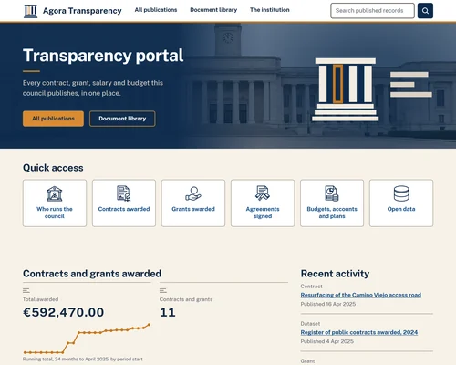

# Ágora Transparency

Ágora Transparency — **Ágora** for short — is a site template for Drupal CMS aimed at **transparency
and open government portals**: small local councils, public bodies, foundations and any organisation
that has to publish what it decides, what it spends and who works for it.



## Status — in development

Ágora is being built in the open and is **not usable as a transparency portal yet**. So far only the
foundation exists: the packaging skeleton, the recipe that composes Drupal CMS, and the test suite
that installs Drupal with the template applied.

**What the template does today**

* Installs a working Drupal CMS site: administrative back end, media, basic SEO, basic privacy and
  consent, anti-spam, authentication tweaks and HTML email.
* Generates a blank front-end theme at install time and sets a blank Canvas landing page as the
  home page.
* Nothing else. There is no transparency-specific functionality in it yet.

**What does not exist yet**, and is therefore not offered by this template — this is the plan, not a
feature list:

| Planned | Where it is going |
|---|---|
| Content model: documents, officials, contracts, budget lines, public calls | unit 002 |
| Ágora's own theme, as the separate project `drupal/agora_theme` | unit 002 |
| Bilingual (ES/EN) demo content and the real screenshot | unit 003 |
| Editorial workflow and freedom-of-information requests | unit 004 |
| AI assistant with citations, and configuration auditing | unit 005 |

The full intended scope is written down in `specs/000-project/plan.md` in this repository.

## Accessibility

**A goal, not a verified result — yet.** Ágora targets WCAG 2.2 AA, and the plan is for automated
accessibility checks over the demo pages to gate every release, with the outcome reported in this
section. No such check has run, because there is nothing to run it against: the template currently
ships no theme, no components and no demo pages. **No conformance with any WCAG level is claimed at
this point.**

## Requirements

* **A plain Drupal site, not a Drupal CMS one.** The installation flow below starts from
  `drupal/recommended-project` — a bare Drupal core 11 codebase — and it is Ágora's own
  `composer.json` that pulls in the Drupal CMS recipes it composes, all constrained to `^2`. You do
  not need a Drupal CMS site to begin; you end up with one because Ágora requires its pieces.
* **PHP:** whatever your Drupal CMS version requires. Ágora adds no constraint of its own; there is
  no `php` entry in its `composer.json`. Drupal core `11.4.5` itself needs PHP `8.3`–`8.5` and
  Composer `2.3.6` or later — see [Toolchain floor](#toolchain-floor) below for where those figures
  come from and what else was measured alongside them.
* Composer. [DDEV](https://ddev.com) is recommended for a local environment; see
  [DDEV's installation instructions](https://docs.ddev.com/en/stable/users/install).

## Installation

> **Ágora is not released yet.** The project exists on Drupal.org —
> [drupal.org/project/agora_transparency](https://www.drupal.org/project/agora_transparency) — but it
> has no released package, so `composer require drupal/agora_transparency` does not resolve today.
> The first release is a later unit of work. Until then, install it from a local checkout, as shown
> below.

**This repository is not a site, and it cannot be brought up on its own.** It is a recipe package:
a `recipe.yml`, its configuration and its metadata. There is no Drupal in it, so there is nothing
here to start. What you do instead is set up a Drupal site somewhere else and add this package to
it as a Composer *path repository*. The sequence below is the one in the project's own
[`.github/workflows/phpunit.yml`](.github/workflows/phpunit.yml), which runs it on every push —
that file, not this section, is the authority, because it is the copy that gets exercised.

Create the project directory and a Drupal codebase inside it, without installing the site yet:

```shell
mkdir agora-site
cd agora-site
ddev config --project-type=drupal11 --docroot=web

# Copy the path repository into the project rather than symlinking it, so the
# installed package is the one an end user would get.
ddev config --web-environment-add="COMPOSER_MIRROR_PATH_REPOS=1"

ddev start
ddev composer create-project --no-install drupal/recommended-project
```

Clone this repository into the project directory, as `source/`, and add it as a path repository:

```shell
git clone <this-repository> source
ddev composer repository add source path source
ddev composer config allow-plugins.drupal/site_template_helper true
ddev composer require --update-with-all-dependencies "drupal/agora_transparency:@dev"
```

Composer places the template in `recipes/agora_transparency`, outside the docroot. The
`allow-plugins` line is needed because Ágora depends on `drupal/site_template_helper`, the Composer
plugin that generates the blank theme; without it, Composer will stop and ask. That is an
install-UX finding, stated honestly rather than smoothed over: without this step the `blank` theme
is never generated, while `recipe.yml` both installs it and pins it as the site's default theme, so
the install fails later for a reason this step does not make obvious. It is resolved for good once
Ágora's theme becomes its own project, `drupal/agora_theme` (see the table above) — until then,
this step stays mandatory, not optional. Check that the package arrived:

```shell
test -d ./recipes/agora_transparency && echo present
```

Then install Drupal with the template applied — either through the web installer, choosing **Ágora**
at the site template step:

```shell
ddev launch
```

…or from the command line:

```shell
ddev drush site:install --yes recipes/agora_transparency
```

Once the site is installed, `ddev exec drush status` reports `Drupal bootstrap : Successful`. Those
two checks — the directory and the bootstrap line — are the whole of what "it worked" means here.

### What a clean install actually does

This is the strongest thing this project can currently say about itself, so it is measured, not
described. Against a real, clean Drupal `11.4.5` on 2026-08-23, from a clone of the canonical
repository at `git.drupalcode.org` — not the working copy, so this is what an end user receives, not
what a developer has — applying the recipe produced **78 steps** and
`[OK] Ágora Transparency applied successfully`, exit 0. The resulting site: Drupal
bootstrap **Successful**, front page **HTTP 200**, the generated `blank` theme set as the site
default, the front page pointed at the Canvas page the recipe creates, and **58** non-core modules
enabled. With the test suite copied in as described in the next section,
`phpunit --fail-on-empty-test-suite` reported **`Tests: 3, Assertions: 38`** — the same counts the
CI pipeline reports.

Once Ágora is published on Drupal.org, the clone and the `repository add` line are replaced by a
plain `ddev composer require drupal/agora_transparency`, and this section will say so.

### Running the tests against an installed package

**The tests do not travel with the package.** `/tests` is `export-ignore`d in
[`.gitattributes`](.gitattributes) — an end user of a site template has no use for its test suite —
and Composer's path-repository mirroring honours `export-ignore` through the same machinery that
builds a release. So the copy under `./recipes/agora_transparency` has no `tests/` directory in it,
no matter how many times you look.

That is a trap with a green face on it: point PHPUnit at the installed package as it stands and it
finds nothing, prints `No tests executed!` and **exits 0**.

Running the tests also needs two things the plain install does not: PHPUnit itself, and the two
environment variables Drupal's functional tests read. Both belong to the setup step above, before
the `composer require` that installs the template:

```shell
ddev config --web-environment-add='SIMPLETEST_BASE_URL=$DDEV_PRIMARY_URL'
ddev config --web-environment-add='SIMPLETEST_DB=$DDEV_DATABASE_FAMILY://db:db@db/db'
ddev composer require --no-update --dev drupal/core-dev
```

Then copy the tests in, from the clone, where `export-ignore` does not apply:

```shell
rm -rf ./recipes/agora_transparency/tests
cp -R ./source/tests ./recipes/agora_transparency/
ddev exec phpunit --configuration=./web/core --fail-on-empty-test-suite ./recipes/agora_transparency
```

`--fail-on-empty-test-suite` is what turns the silent version of that failure into a loud one; the
CI workflow passes it for the same reason. Any `ddev composer` command run after the copy
re-mirrors the path repository and deletes the tests again, so keep the copy as the last step
before you run them.

## What it ships

The package a user receives — through the path-repository clone above, or later through a real
Composer release — is eight entries: `AGENTS.md`, `LICENSE.txt`, `README.md`, `composer.json`,
`content/`, `recipe.yml`, `recommended.yml`, `screenshot.webp`. That is not a partial list; it is
what the clean-install evidence above found on disk after Composer mirrored the package.

**Tests do not ship, on purpose.** `/tests` is `export-ignore`d in
[`.gitattributes`](.gitattributes) — an end user of a site template has no use for its test suite —
so it is absent from every installed copy, not only from a tagged release. See
["Running the tests against an installed package"](#running-the-tests-against-an-installed-package)
above for what that means in practice and how to run them anyway, deliberately, when you need to.

## What the template applies

Recipes, in the order `recipe.yml` applies them:

| Recipe | What it contributes |
|---|---|
| `core/recipes/administrator_role` | A generic administrator role with all permissions |
| `core/recipes/core_recommended_maintenance` | Core modules that help with site maintenance |
| `core/recipes/core_recommended_performance` | Core modules that improve performance |
| `drupal_cms_admin_ui` | The administrative back end, with its theme and site management modules |
| `drupal_cms_anti_spam` | Basic anti-spam protection |
| `drupal_cms_authentication` | Tweaks to user authentication |
| `drupal_cms_media` | Basic media types and configuration |
| `drupal_cms_privacy_basic` | Basic privacy and consent management |
| `drupal_cms_seo_basic` | Basic SEO tools and configuration |
| `easy_email_express` | HTML email |

It also installs `drupal_cms_helper`, the `stark` theme and the generated `blank` theme, points the
front page at a blank Canvas landing page shipped in `content/`, makes `blank` the default theme, and
hides from the Canvas page builder a set of administrative components that are not useful for
building pages.

## Known limitations

* **The site has no design.** The default theme is `blank` — a deliberately empty theme. Ágora's own
  theme is a separate project that does not exist yet.
* **`screenshot.webp` is a placeholder**, and says so on its face. It is not a picture of an
  installed site.
* **No demo content**, beyond the empty home page.

## Toolchain floor

What each platform this project is developed or gated on actually provides — measured, not
reasoned about. A tool that silently changes behaviour between platforms is the kind of defect that
fails *green*: the failure looks like a pass until someone runs it somewhere else.

| Platform | Status |
|---|---|
| Windows dev host (MSYS2 / Git for Windows) | GNU grep **3.0**; `grep -IFin` returns **rc 134 (SIGABRT)** — combining `-F` with `-i` aborts it. `jq` 1.8.2, Python 3.12.6, PHP 8.4.24 **ZTS**, Composer 2.10.2. Windows Python defaults to **cp1252**, so any script opening a repository file needs `encoding='utf-8'` explicitly — the product is named *Ágora*, and the `Á` breaks the default. |
| WSL2 Ubuntu 24.04 | `docker-ce` **28.1.1**, DDEV **1.24.4**. This is where the clean-install smoke above actually runs, and it is DDEV's own recommended Windows setup. |
| drupalcode CI runner | `jq`, `python3`, `curl`, `git` and `composer` all present — verified by the invariants job passing its preflight, after this project predicted some might be missing and was wrong. |
| macOS | **NOT MEASURED.** Ships BSD grep, not GNU grep, so its `-Fin` behaviour, its exit-status semantics and its handling of the patterns this repository's scripts use are all open questions. |

Any platform not in this table, or listed with a gap in it, is **NOT MEASURED** — never a plausible
guess. That is the entire point of keeping the table at all.

Drupal itself has a floor independent of the row above: core `11.4.5` needs PHP `8.3`–`8.5` and
Composer `2.3.6` or later.

`tests/bin/doctor` is how a machine gets checked against all of this. Run it before trusting
anything else on a new host, and trust its output over this table: a table decays, a probe does
not.

## Continuous integration

Ágora's pipeline is the shared `gitlab_templates` pipeline the Drupal Association maintains, run on
[git.drupalcode.org](https://git.drupalcode.org), plus one job of our own defined on top of it,
`agora-invariants`. This is the list of jobs that actually ran, taken from pipeline `933556` on
branch `1.x`, commit `5556bb3`, read from the API on 2026-08-23 — not from the badge, and not from
the set of jobs the template could in principle run:

| Job | Stage | Status | Blocking |
|---|---|---|---|
| `composer` | build | success | yes |
| `composer-lint` | validate | success | yes |
| `cspell` | validate | success | yes |
| `eslint` | validate | success | yes |
| `phpcs` | validate | success | yes |
| `phpstan` | validate | success | yes |
| `phpunit` | test | success | yes |
| `agora-invariants` | validate | success | yes |

**Eight jobs · all blocking · zero named exceptions.**

This table is a dated measurement, not a promise: whichever commit changes the CI job list, the
packaged file set or a gate's denominator is the commit that updates it.

**Two checks are absent, and an absent check is not a passed one.**

* `stylelint` did not run because there is no CSS in the package for it to read. Ágora's theme is a
  separate project, so this job may never run in this repository at all.
* `secret detection`, GitLab's own credential scanner, is not part of the three included template
  files, so it still does not run as a job. The gap it would cover is narrower than it looks:
  `tests/bin/no-secrets` runs on every push inside `agora-invariants`, which executes both gate
  runners — `gate-a-wave1.sh` (61 checks · 0 failures) and `gate-a-wave3.sh` (35 checks · 0
  failures), 10 invariants in total — not only when a human types them by hand.

**The gate is the list of jobs, never the pipeline's status field.** This is not a preference. An
earlier pipeline reported `success` while the spell check inside it had failed: four of the seven
jobs then defined were non-blocking by upstream default, so their failures were recorded and then
rolled up into a green result that hid them. All eight jobs are blocking now, with no exceptions —
`_ALL_VALIDATE_ALLOW_FAILURE: '0'` in [`.gitlab-ci.yml`](.gitlab-ci.yml) is what makes the validate
stage stop the pipeline. Read the job list; the status field has already been wrong here once.

**What the green does not tell you.** The 36-versus-63 gap reported earlier is closed: `cspell` now
reports `Files checked: 62`, two of which are files the CI runner generates and this repository does
not track (`.editorconfig`, `gitlab_templates_version.txt`). Of the repository's 65 tracked files, 60
are opened. The other five are skipped by the upstream `.cspell.json` defaults, not by omission:
`.eslintrc.json` and `.gitignore` match its dotfile/`*ignore` ignore patterns, `LICENSE.txt` and
`composer.json` match its case-insensitive filename list regardless of extension, and
`screenshot.webp` is binary, which `cspell` does not open. `phpcs`, `phpstan` and `eslint` still
print no file count at all. A passing check over an unknown number of files is a weaker statement
than it looks, and it is written down here as one rather than counted as coverage.

### Checking spelling before you push

`cspell` is blocking, and it reads `README.md` and everything under `specs/`. That makes every prose
commit a gate, so run it before you push:

```shell
bash tests/bin/spellcheck
```

It prints the file count and either `Issues found: 0` or the words, and it exits non-zero when it
finds something — so it is usable in a hook or a loop, not only by eye.

**What changed, and why the old advice is gone.** This section used to offer a bare
`pnpm dlx cspell@9.8.0 --locale en,en-GB README.md "specs/**/*.md"` and warn that it was *"an
approximation … not a second opinion on the gate"*. It was worse than an approximation. This
repository deliberately has **no `.cspell.json`** (D-024(2)), so that command loaded no project
dictionary and neither of Drupal core's: it reported hundreds of words the job accepts, and the
real failures were indistinguishable inside the noise. **Three consecutive pipelines went red on
`cspell`** — `934242`, `934297`, `934329` — while the local command kept printing the same
unreadable output it always printed.

`tests/bin/spellcheck` fetches the job's actual inputs instead of guessing them: the
`assets/.cspell.json` that `gitlab_templates` copies in, Drupal core's two
`core/misc/cspell/*.txt` dictionaries, and this project's `.cspell-project-words.txt` — then applies
in shell the same transformations `scripts/prepare-cspell.php` applies in the job. It reads
**tracked and stage-able files both**, because a file about to be committed is a file the job will
read. Verified equivalent against pipeline `934329` on 2026-08-24: same verdict before the fix, and
`65 files checked · 0 issues` after it. It is a replica, not the job — it pins nothing about the
runner's Node version, and upstream can change `prepare-cspell.php` without this file noticing.
The first run needs network for those three inputs and caches them in `.cspell-cache/`, which is
git-ignored; later runs are offline, and a stale cache says so rather than pretending.

Words that are genuinely words go in
[`.cspell-project-words.txt`](.cspell-project-words.txt), one at a time, each with the reason it
belongs there written beside it. A **verbatim quotation** is not vocabulary and does not go there:
it is scoped where it sits, with `cspell:disable`/`cspell:enable` around a phrase or `cspell:ignore`
for a long quoted passage — which is why the research file quoting four Spanish statutes carries
~190 words in its own header and none of them in the project dictionary. The job offers an artefact
that is "this dictionary plus everything that just failed"; importing that wholesale is one command
away from a green pipeline and is forbidden here, because it declares the next real misspelling
correct before anyone has seen it.
## Support

Bugs and questions go to the project's issue queue on Drupal.org:
[Issues for Ágora Transparency](https://www.drupal.org/project/issues/agora_transparency). It is open
and currently empty. There is no release yet, so there is no supported version to report against —
anything filed today is about work in progress.

## License

GPL-2.0-or-later. See [LICENSE.txt](LICENSE.txt).

## Development process

Ágora is built with a human-in-the-loop process, and the artefacts of that process are kept in the
open rather than tidied away before release.

* **Decisions are signed before they are implemented.** Every load-bearing choice — the package
  name, the recipe architecture, where the theme lives, the dependency policy, the publication
  route — is recorded as a numbered, append-only entry in
  [`specs/000-project/DECISIONS.md`](specs/000-project/DECISIONS.md) and approved by a human
  before any code depends on it. Signed entries are never rewritten: they are amended or superseded.
* **Work is planned in units and waves.** Each unit under [`specs/`](specs/) carries a plan, an
  explicit task list and a verification gate that has to pass with real counts — an exit code of
  zero on its own does not close anything.
* **AI assistance is used, and disclosed.** Parts of this repository were drafted with AI coding
  assistants working under human direction and review. The instructions those assistants operate
  under are in `CLAUDE.md` and `.claude/`, in this repository, for anyone to read. A human reviews
  and signs every decision and every gate and is accountable for what is released. Commits are
  attributed to their human author, with no AI co-authorship trailers.
* **The process layer does not ship.** `CLAUDE.md`, `.claude/` and `specs/` are marked
  `export-ignore` in `.gitattributes`: they stay visible to anyone who clones the repository, but
  they are not part of the packaged release an end user installs. `AGENTS.md` is the deliberate
  exception — it is product, and documents how AI assistants should work on a site built *with*
  this template.
